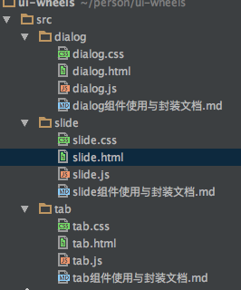

> 注: 项目是我学习造轮子时的经验整理,组件的设计思路参考部分代码的链接,也推荐给大家,如下:

 
## 写这个造轮子项目的初衷

> 在我前端1年左右的工作学习中,目前能够胜任现有公司的Vue业务代码,同时已经掌握JavaScript的核心基础时,
不知道应该如何进一步去提升自己应用JavaScript的能力,因为前端书籍里可能多数的内容可能都是已经熟知的,从头看书有些低效。
所以尝试学习优秀的开源项目、并自己造一些UI轮子

## 项目结构



- 按照html / css / js 来划分的项目目录,
- 每一个组件目录都有相对应的文档说明,里面也介绍了组件的封装思路和注意点 


## 组件效果预览

https://ziwei3749.github.io/ui-wheels/

## 打开方法

```
    git clone https://github.com/FrankFang/wheels.git
    
    cd wheels 
    
    用浏览器打开 index.html
```

## 推荐的阅读顺序

- 1 可以根据效果预览,先尝试自己抽象出一个组件。
- 2 如果第一步遇到困难,那就先不用抽象组件,只是实现样式效果。
- 3 阅读源码和注释,理解后自己实现一遍
- 4 遇到问题,可以去翻我写的这个组件封装中的思路和要点
- 5 遇到其他问题的,你还可以提交issue


## 关于我

- 邮箱: 18500905537@163.com
- SegmentFault: https://segmentfault.com/u/ziwei3749
- blog: https://github.com/ziwei3749/blog
